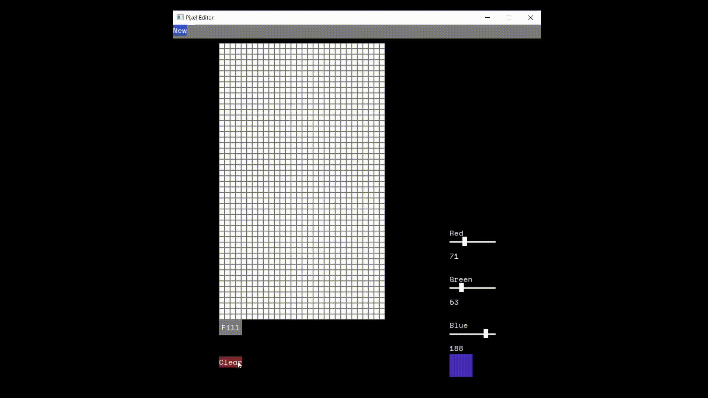

# Pixel Editor

This a pixel editor created with SDL2 aimed at creating unique and interesting designs.

## Overview

The goal of this project was to learn more about graphics applications and dealing with image data on a pixel level. This was inspired by Adobe Photoshop and was meant to be a simplistic version of that software.

## Programming Language

C++

## Features Developed

-   grid-based canvas
-   real-time input
-   history management
-   user-based color selection
-   ability to create new canvases dynamically
-   functionality to fill an area to speed drawing process
-   clearing the canvas

## Demo

## Images

<figcaption>Canvas creation</figcaption>

<figcaption>User-input color selection</figcaption>

<figcaption>Canvas clearing</figcaption>

